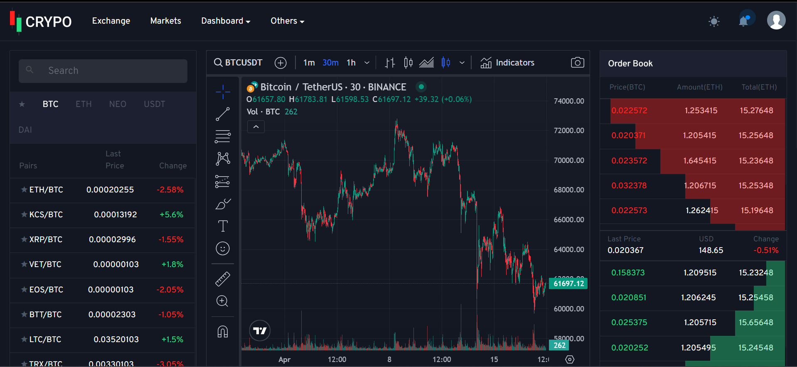

# Crypto Tracker

Une plateforme épurée pour suivre les changements dans le marché des cryptomonnaies.

## Contexte du Projet

Une compagnie de crypto souhaite suivre les changements de cryptomonnaies sur le marché via une plateforme épurée, offrant un accès facile à l'information. Pour ce faire, vous devrez vous référer à la documentation API disponible dans les ressources.

## Prérequis

- PHP >= 8.4
- Apache or Nginx web server
- MySQL or MariaDB database

## Fonctionnalités

### Marchés (Markets)

- Index des marchés disponibles.
- Tri rang et prix en USD.

### Actifs (Assets)

- Index des actifs disponibles.
- Tri ascendant/descendant par nom et prix.
- Page détaillée de chaque actif avec un graphique montrant les variations de prix par ordre chronologique.

### Échanges (Exchanges)

- Index des échanges disponibles.
- Tri ascendant/descendant par volume en USD.
- Page détaillée de chaque échange.

### Bonus

- Utilisation du WebSocket pour une analyse en direct des marchés de cryptomonnaies.
- Interprétation de toute la documentation fournie dans les ressources.

## Documentation API

Consultez la documentation API dans les ressources pour obtenir des détails sur l'intégration des données et des fonctionnalités.

## Développement

- git clone :
     (https://github.com/Youcode-Classe-E-2023-2024/Squad5-crypto.git)
## Auteur

***Mohammed Loussal***

## Developers
***Mohammed Bachiri***
***Hafsa ELMoatassim billah***
***Maryam JAMMAR***
**kholod sanak***

## Licence

Ce projet est sous licence [MIT License](LICENSE).
